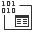

#### 

[Project](../../../../../../index.md) > [192.168.19.40\\ERIS](../../../../../index.md) > [User databases](../../../../index.md) > [TIMM_Reports](../../../index.md) > [Programmability](../../index.md) > [Types](../index.md) > [User-Defined Table Types](User-Defined_Table_Types.md) > dbo.MSISDN

#  [dbo].[MSISDN]

---

## Properties

| Property | Value |
|---|---|
| Collation | Latin1_General_CI_AS |
| Heap | YES |

---

## Columns

| Name | Data Type | Max Length (Bytes) | Nullability |
|---|---|---|---|
| MSISDN | varchar(15) | 15 | NULL allowed |

---

###### Author:  WDAGUtilityAccount

###### Copyright 2021 - All Rights Reserved

###### Created: Thursday, September 16, 2021 10:19:43 PM

